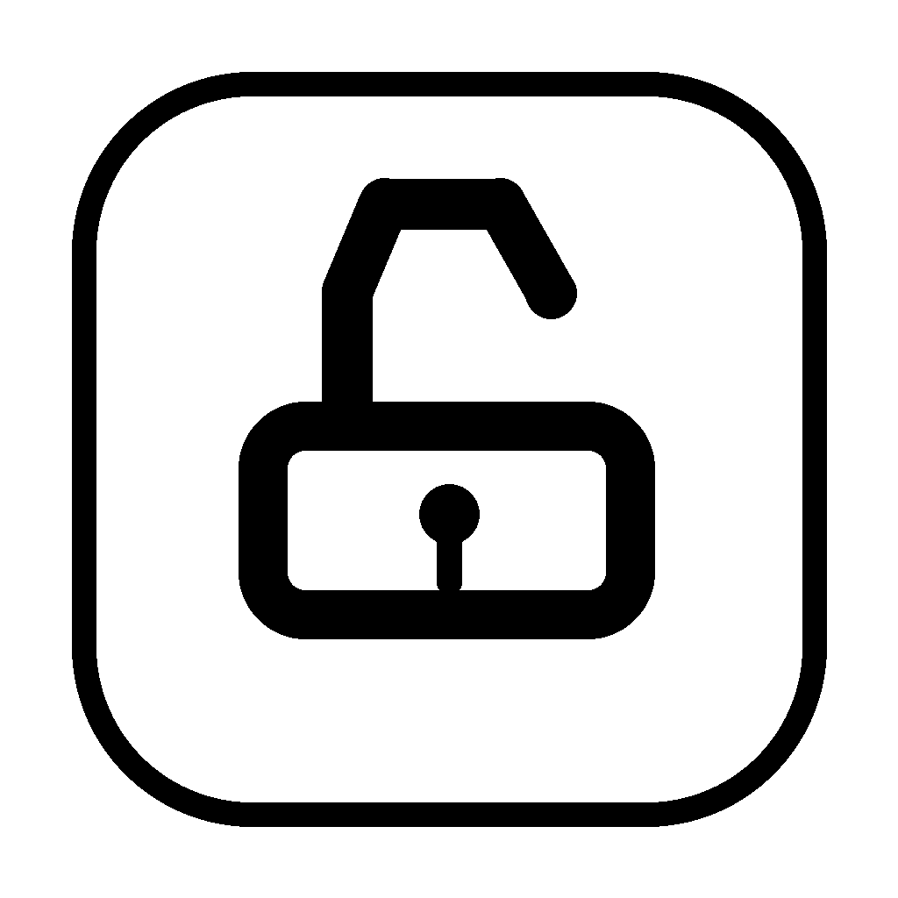

# Codex Switch

Codex Switch is a tiny macOS menu bar and Windows tray helper for Codex.

It keeps the app focused on one workflow: switch Codex relay profiles, keep official ChatGPT login for remote control, and launch Codex with plugin unlock enabled.



## Features

- **Multiple relay profiles**: save multiple Base URL / API Key profiles and switch between them.
- **Codex-only UI**: a lightweight provider list inspired by CC Switch, without the extra multi-app features.
- **Custom provider writer**: writes the active profile to `~/.codex/config.toml` as `model_provider = "custom"`.
- **Remote control preserved**: keeps Codex using the official ChatGPT login state while routing model requests through your relay API.
- **Plugin unlock**: launches Codex with CDP and injects the plugin unlock script.
- **Menu bar / tray only**: no Dock icon on macOS, no window on launch.
- **Low battery impact**: no LaunchAgent, no KeepAlive, no background polling; the local Node service starts only when needed.

## Menu Bar

Click the menu bar icon to show three actions:

- `打开面板`: open the Codex Switch panel.
- `启动`: apply the active profile, launch Codex, and inject plugin unlock.
- `退出`: quit Codex Switch.

If the panel is closed, the local Node service is stopped. The menu bar process remains idle.

## Install

Download the build for your system from the latest GitHub Release:

- macOS Apple Silicon: `Codex-Switch-macos-arm64.zip`
- Windows x64: `Codex-Switch-windows-x64.zip`

Unzip it, then open `Codex Switch.app` on macOS or `Codex Switch.exe` on Windows.

If macOS blocks the unsigned app, allow it in:

```text
System Settings -> Privacy & Security
```

## Build From Source

Requirements:

- Node.js 22 or newer
- Xcode Command Line Tools and Python 3 with Pillow for the macOS app bundle
- Electron Builder for the Windows tray build, installed by `npm install`

Build macOS:

```bash
npm install
npm run check
npm test
./build-macos-app.sh
open "dist/Codex Switch.app"
```

Build Windows:

```bash
npm install
npm run check
npm test
npm run build:windows
```

Run the web panel directly:

```bash
npm start
open http://127.0.0.1:38383
```

## Data Locations

- Codex config: `~/.codex/config.toml`
- Codex official login state: `~/.codex/auth.json`
- Codex Switch relay profiles: `~/.codex/codex-switch.json`

On Windows, `~` resolves to your user profile, for example `C:\Users\you\.codex`.

API keys are stored in plain text by design, so you can paste, inspect, and edit them easily.

Active Codex config shape:

```toml
model_provider = "custom"

[model_providers.custom]
name = "custom"
wire_api = "responses"
requires_openai_auth = true
base_url = "https://example.com/v1"
experimental_bearer_token = "sk-..."
```

## How It Works

Codex Switch does not modify the Codex app bundle.

It starts Codex with a local Chromium DevTools Protocol port, then injects a small renderer script into the current Codex window. The relay config is written to your normal Codex config file, so Codex still sees a standard `custom` model provider.

## Security Notes

- API keys are saved in plain text in your local home directory.
- The app listens only on `127.0.0.1`.
- Visible logs redact API keys and bearer tokens.
- No auto-start agent is installed.

## Credits

The provider-list UI direction is inspired by [CC Switch](https://github.com/farion1231/cc-switch). Codex Switch is a smaller Codex-only helper and does not reuse CC Switch code.

## Contributors

- hu
- Codex

## Development

```bash
npm run check
npm test
```
